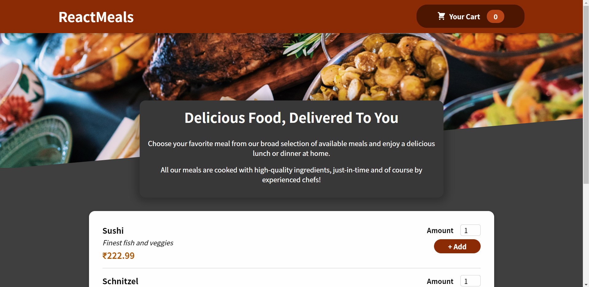

# food-order-app
[View this project](https://quirky-ride-c1bd97.netlify.app/)

I created a simplified version of a food ordering app. 
First, the user will be greeted with a food list. 
They can select the quantity and add the item to the cart.
Adding an existing item to the cart will result in incrementing the quantity of the item that’s already in the cart. 
Once the user is done adding items to their cart, they can click on the Your Cart button in the header. 
This will navigate them to the order summary screen. 
This screen is where all the items they added to their cart is listed along with the amount they need to pay.
